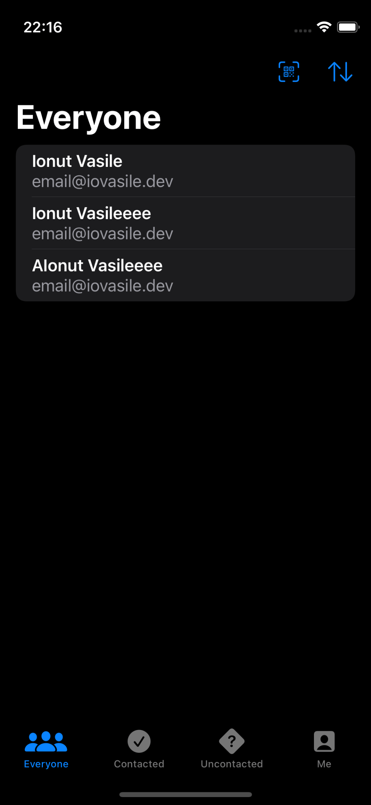

## HotProspects

#### Description:

HotProspects is an app I built while following [100 Days of SwiftUI](https://www.hackingwithswift.com/100/swiftui) by [Paul Hudson](https://www.twitter.com/twostraws).

It shows a QR code that stores your information, then others can scan that code to add you to their list of possible leads for later follow up.

#### Screenshots:

<section align="left">

&nbsp;

</section>

## Installation and Setup Instructions

#### Prerequisites

    ⚠️ MacOS Monterey

    ⚠️ Xcode 13

#### Instructions:

    1️⃣ Clone this repository.

    2️⃣ Run it in Xcode.

## Reflection

#### Summary

    ➡️ Used Custom Environment Objects to easily share data between views
    ➡️ Created a TabView to present my views
    ➡️ Learned about Result and how it can make it easier to work with async data
    ➡️ Used objectWillChange to trigger UI updates on specific operations
    ➡️ Generated a QRCode from a string using CoreImage
    ➡️ Set .interpolation to .none to display the generated QRCode correctly
    ➡️ Created a context menu to allow the user to save the qr code to their gallery
    ➡️ Used Swift Package Manager to add a QRCode Scanner dependency
    ➡️ Implemented a Local Notification system using UserNotification, allowing the user to set a reminder to contact prospects
    ➡️ Added multiple buttons to the item swipe menu

#### Conclusion

Another project finished and man, it feels great.

The challenges seemed very easy, and I was able to tap into all I've learned recently to get the job done nice and fast. The growing knowledge base were I store reusable pieces of code is a GAMECHANGER.

Also, this chapter was PACKED with amazing techniques. My favourite technique from this chapter was the UserNotification stuff. It's such an essential functionality in modern apps, yet it's so easy to setup and use with SwiftUI.

There's so much I don't know and so much I'm not even aware of, but I'm feeling very good about my progress. On to the next project.
