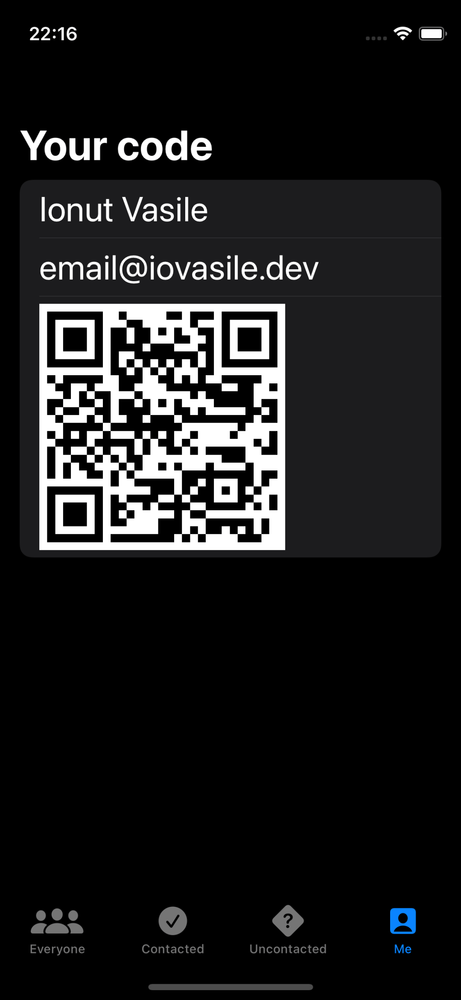

## HotProspects

#### Description:

HotProspects is an app I built while following [100 Days of SwiftUI](https://www.hackingwithswift.com/100/swiftui) by [Paul Hudson](https://www.twitter.com/twostraws).

It shows a QR code that stores your information, then others can scan that code to add you to their list of possible leads for later follow up.

#### Screenshots:

<section align="left">

&nbsp;

</section>

## Installation and Setup Instructions

#### Prerequisites

    ⚠️ MacOS Monterey

    ⚠️ Xcode 13

#### Instructions:

    1️⃣ Clone this repository.

    2️⃣ Run it in Xcode.

## Reflection

#### Summary

    ➡️ Used Custom Environment Objects to easily share data between views
    ➡️ Created a TabView to present my views
    ➡️ Learned about Result and how it can make it easier to work with async data
    ➡️ Used objectWillChange to trigger UI updates on specific operations
    ➡️ Generated a QRCode from a string using CoreImage
    ➡️ Set .interpolation to .none to display the generated QRCode correctly
    ➡️ Created a context menu to allow the user to save the qr code to their gallery
    ➡️ Used Swift Package Manager to add a QRCode Scanner dependency
    ➡️ Implemented a Local Notification system using UserNotification, allowing the user to set a reminder to contact prospects
    ➡️ Added multiple buttons to the item swipe menu

#### Conclusion

Completing this project got me very very hyped. I feel like I could go ahead and build any app right now. But then I remember there's so much stuff I don't know, and then there's so much stuff I'm not even aware off. Anyway, this was a PACKED chapter, and I feel like I learned alot of very useful things, but this could have been said about every project. I'm excited to get to the next one, where hopefully I'll get to practice all this and learn some new things too.
